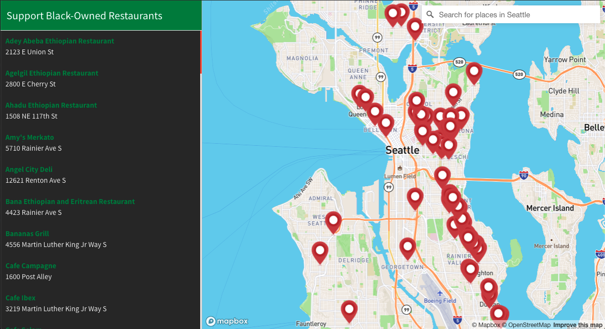
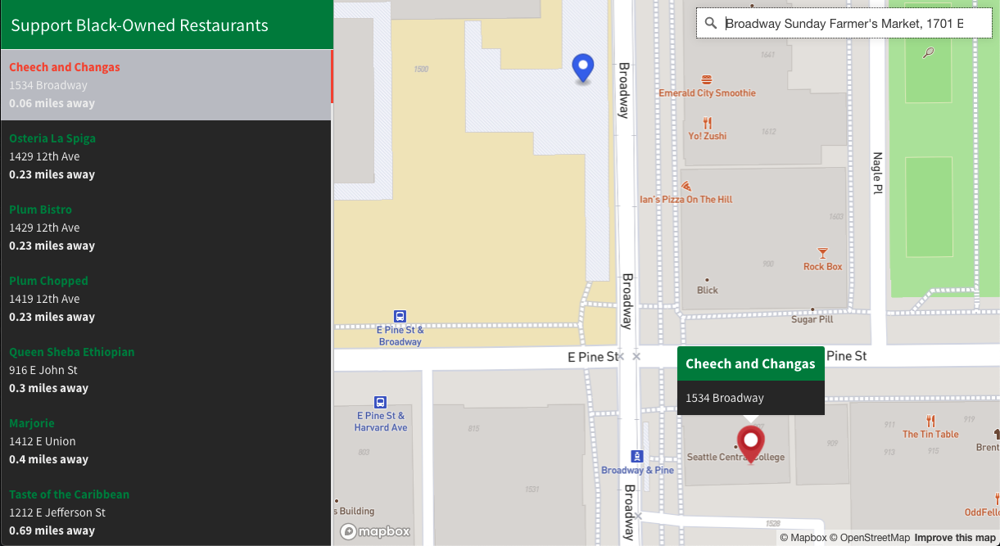
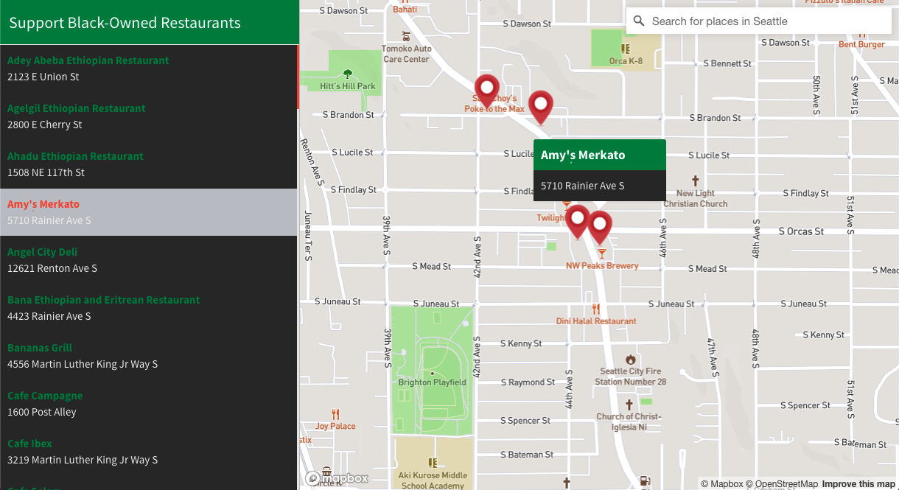

# Black-Owned Restaurants in the Seattle Area

**Application Link:** https://ebar23.github.io/Black-OwnedBiz_Final_Project/index.html#

**GitHub Repository Link:** https://github.com/ebar23/Black-OwnedBiz_Final_Project

## **Project Description:**

This map application is a list of Black-Owned Restaurants in the Seattle area. When you type in a certain address in the "***Search for places in Seattle***" box, on the left hand side you will see that the list of restaurants has been rearrange to show which business is closest to said location. This is determined by taking in the searched location's coordinates and the coordinated of the restaurants to see which one has the shortest distance in a mile measurement. The user may use this as the preferred way of searching for restaurant locations. (see below)

An alternative would be to simply **click** on one of the **Red Pin Icons** to see the information the name and address of the chosen business. It will also be highlighted on the list on the left hand side.(see below)

That is all there is too it.

## **Project Goal**

This project was intended to bring more awareness to the locations of Black-Owned Businesses in the Seattle area. While we still continue to live in a COVID present world where things are slowly but surely getting back to normal, businesses have been impacted greatly and are trying to stay afloat. Minority-owned businesses are no exception to this, and for this reason, I decided to dedicate my project to the African-American community here in Seattle to help them gain more clientele.

Personally, as a minority myself and a family that does own their own business, I saw first hand the impacts that the pandemic had on POC. For this reason, it was with no hesitence that I decided to choose a project like this one because ultimately, those that benefit from it most are the ones that need it most. I didn't do this out of charity, but rather in solidarity with my BIPOC. I am a proud first-generation Latino and will always represent.

## **Main Functions Used in Code**

- ***geojsonFetch()*** This is the function that allowed me to download my datafile onto to my program so that I would be able to utilize and manipulate it to my desire.

- ***geocoder.on()*** This function is what makes the search bar able to function properly. It gives it the ability to look up geographical information within its bounding box.

- ***addMarkers()*** This function adds markers to each restaurant listed within the map.

- ***buildLocationList()*** This function builds the list of restaurants listed within my .json file and displays it properly on the side panel.

- ***flyToStore()*** This function jumps to the restaurant that was either clicked on the map or on the list.

- ***createPopUp()*** This function creates the popup of information pertaining to the restaurant that was clicked.

## **Applied Libraries and Web Services**

The libraries and Web Services used for this project are as listed below:
- [Mapbox GL js](https://www.mapbox.com/)
- [Turf](https://turfjs.org/)
- [GitHub](https://github.com/)
- [Mapbox Studio](https://studio.mapbox.com/)

## **Data Source & Acknowledgment**

I was able to find an article from [*KING 5*](https://www.king5.com/article/news/community/support-black-owned-shops-restaurants-washington-state/281-f79ce92a-4ef0-4036-ae89-86504ee2fee7) local news that had an extensive list of Black-Owned businesses for most of Western Washington. This list was compiled together to bring awareness to businesses owned by BIPOC and also to show solidarity with the Africa-American community after the George Floyd murder in 2020 and the BLM movement. I hadn't even seen this list compiled until I was given this assignment so I figured it would be great to resurface this to bring more attention on the matter.

The link to the article is [here](https://www.king5.com/article/news/community/support-black-owned-shops-restaurants-washington-state/281-f79ce92a-4ef0-4036-ae89-86504ee2fee7).
